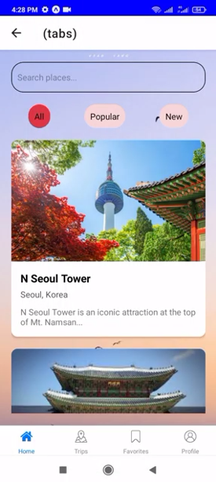
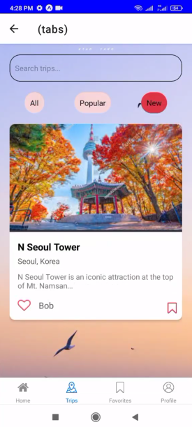
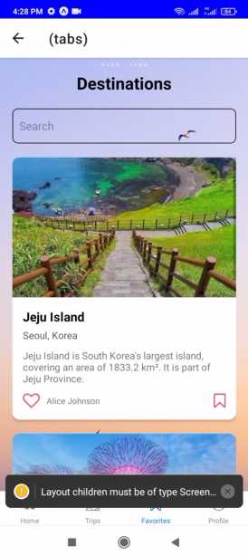
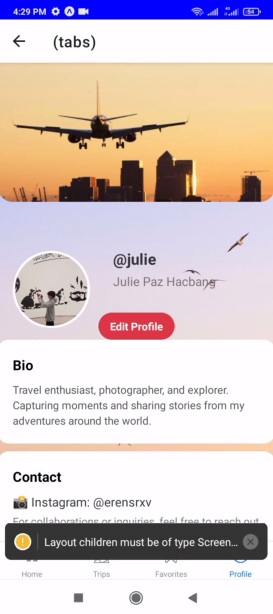

# Wander
Wander Mobile App.

# Features
* Easy Navigation
* Updated Content
* Responsive Customer Support
* Local Insights

# Course Overview
* Basic React Native Components
* Database Design using Appwrite
* User Registration & Authenticaiton
* Deployment

# Tech Stack
* React Native
* AppWrite
* HTML, CSS and JS

# Home Screen
  

# Sign Up Screen
  

# Sign In Screen
  

# Tabs Screen
  
 
 
 

# Screen Demo 
https://youtube.com/shorts/Kv6qjTcD6m0?feature=share
